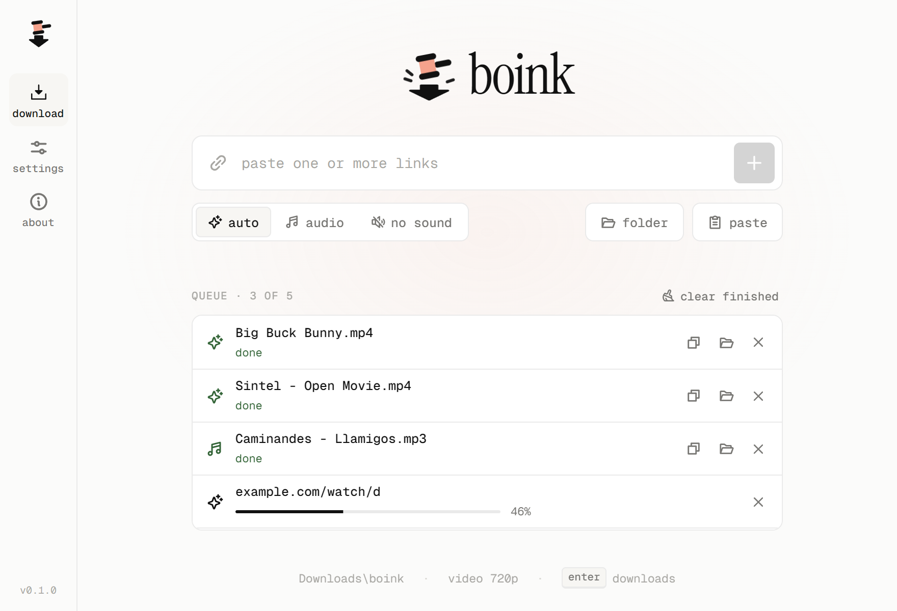
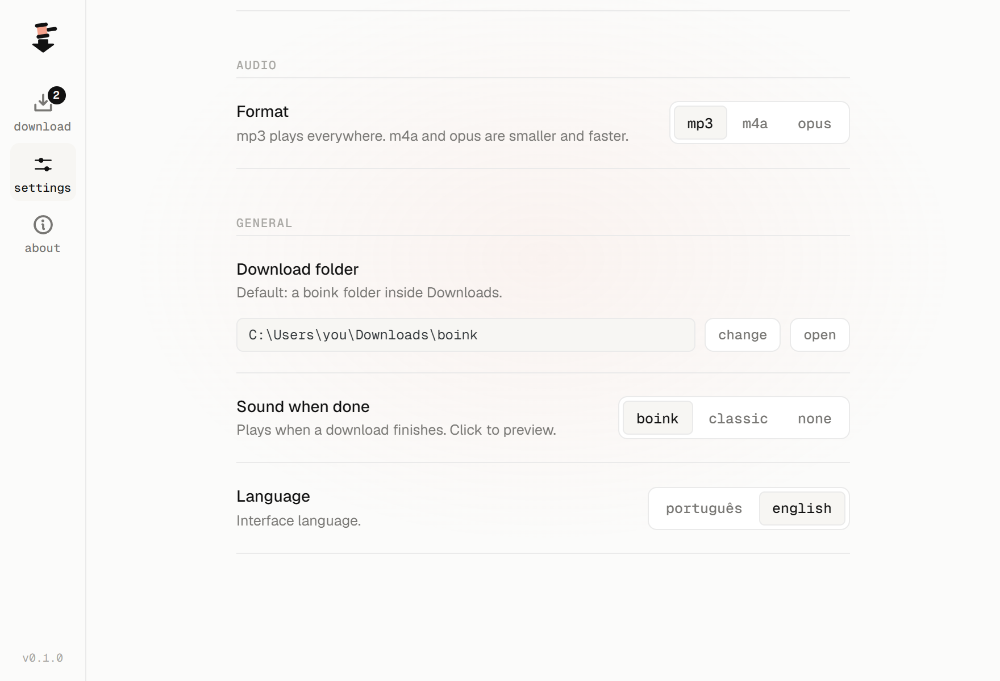

<div align="center">


# boink

**Paste a link, get the video.** A small Windows app for downloading video and audio from YouTube and [over a thousand other sites](https://github.com/yt-dlp/yt-dlp/blob/master/supportedsites.md).

[**Download for Windows**](https://github.com/w-felipe360/boink/releases/latest) · [Português](README.pt-BR.md)

<picture>
  <source media="(prefers-color-scheme: dark)" srcset="docs/screenshot-home-en-dark.png" />
  
</picture>

</div>

## Features

- **Paste and go.** One link or a whole list at once. They download one after another in a queue you can cancel, retry or clear.
- **Three modes:** video with sound, audio only (mp3, m4a or opus), or video without sound.
- **Sensible sizes.** 720p by default, preferring 30 fps and H.264/AAC so files are small and play everywhere. Pick 480p, 1080p or max in settings.
- **Real progress** for each item, plus buttons to open the file, show it in its folder or copy its path.
- **Your folder.** Saves to `Downloads\boink` by default, or any folder you choose.
- **A boink when it's done.** Pick the meme bonk, a softer classic sound, or silence.
- **English and Portuguese (Brazil)**, following your Windows language, switchable in settings.
- No account, no ads, no tracking. Everything runs on your computer.



## Install

1. Download `boink_x.y.z_x64-setup.exe` from the [latest release](https://github.com/w-felipe360/boink/releases/latest).
2. Run it. It installs for your user only, no admin rights needed.

Requires Windows 10 or 11 (64-bit). The installer sets up Microsoft Edge WebView2 if it's missing.

> **"Windows protected your PC"?** The installer isn't code-signed yet, so SmartScreen warns about it. Click **More info → Run anyway**. You can also build it yourself from source (below).

## Build from source

You'll need [Node.js](https://nodejs.org) 20+, [Rust](https://rustup.rs) and the [Tauri prerequisites for Windows](https://v2.tauri.app/start/prerequisites/) (Microsoft C++ Build Tools and WebView2).

```powershell
git clone https://github.com/w-felipe360/boink.git
cd boink
npm install
npm run sidecars      # downloads yt-dlp and ffmpeg into src-tauri/bin (not stored in git, ffmpeg is ~160 MB)
npm run tauri dev     # run in development
npm run tauri build   # build the installer into src-tauri/target/release/bundle/nsis
```

### Releases

Releases are built by GitHub Actions on a Windows runner:

- **New version:** `npm run set-version -- patch` (or `minor`, `major`, `x.y.z`), commit, then `git tag vX.Y.Z && git push --follow-tags`. [`release.yml`](.github/workflows/release.yml) builds the installer and publishes the release.
- **yt-dlp updates ship by themselves.** Sites change often and yt-dlp keeps up, so every Monday [`update-yt-dlp.yml`](.github/workflows/update-yt-dlp.yml) checks for a new yt-dlp. If there is one, it pins it in [`sidecars.json`](sidecars.json), bumps the patch version and releases a new installer.
- **Test build:** run the *release* workflow by hand from the Actions tab. The installer is kept as a workflow artifact and nothing gets published.

Locally, `npm run sidecars -- -Latest` tries the newest yt-dlp without changing the pin.

### How it works

The interface is React + TypeScript (`src/`). The Rust side (`src-tauri/src/lib.rs`) runs [yt-dlp](https://github.com/yt-dlp/yt-dlp) and [ffmpeg](https://ffmpeg.org) as bundled sidecar processes, streams progress back to the UI, and handles cancelling, folders and opening files.

A couple of choices worth knowing about:

- **yt-dlp always runs with `--force-ipv4`.** On networks where IPv6 is configured but doesn't actually route, yt-dlp hangs forever on sites that publish IPv6 addresses (YouTube included). Every site still serves IPv4, so nothing is lost.
- **"No sound" downloads** pick a video-only stream when the site has one. Otherwise ffmpeg strips the audio track afterwards, without re-encoding.

## Please use it responsibly

boink is a tool for saving media you have the right to download: your own uploads, Creative Commons and public-domain videos, content whose license allows it. Respect copyright and each site's terms of service.

## License

boink is [MIT licensed](LICENSE). The installer also bundles yt-dlp (Unlicense), FFmpeg (GPL-3.0) and other components under their own licenses; see [THIRD-PARTY-NOTICES.md](THIRD-PARTY-NOTICES.md).
