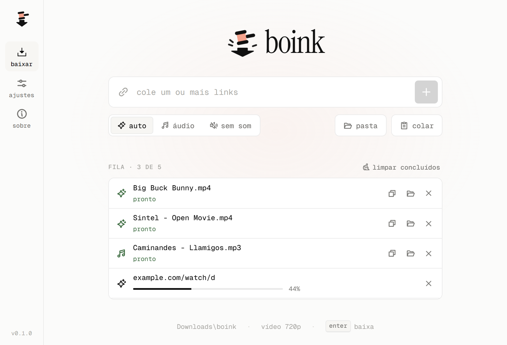
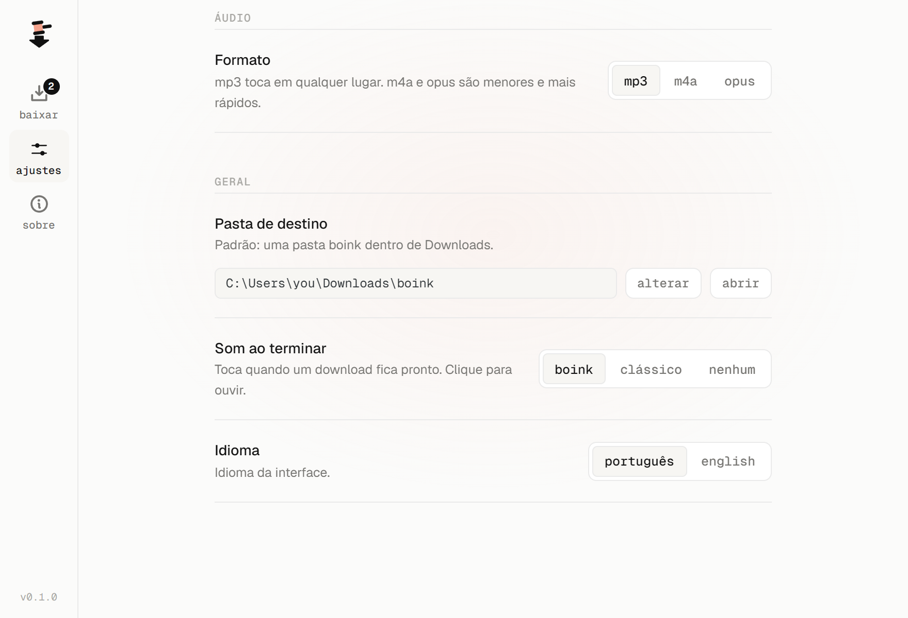

<div align="center">


# boink

**Cola o link, recebe o vídeo.** Um app pequeno pra Windows que baixa vídeo e áudio do YouTube e de [mais de mil outros sites](https://github.com/yt-dlp/yt-dlp/blob/master/supportedsites.md).

[**Baixar para Windows**](https://github.com/w-felipe360/boink/releases/latest) · [English](README.md)



</div>

## O que ele faz

Você cola um link, ou uma lista inteira de uma vez, e o boink baixa um depois do outro. Na fila dá pra cancelar, tentar de novo e limpar o que já terminou, e cada item mostra o progresso real do download.

São três jeitos de baixar: vídeo com som, só o áudio (mp3, m4a ou opus) ou o vídeo sem som.

O padrão é 720p, de preferência a 30 fps e em H.264/AAC. Assim os arquivos ficam leves e abrem em qualquer player. Se precisar de outra qualidade, os ajustes têm 480p, 1080p e máxima.

Tudo vai pra `Downloads\boink`, a não ser que você escolha outra pasta. Quando o download termina, um clique abre o arquivo, e do lado tem botões pra mostrar ele na pasta ou copiar o caminho completo.

E sim, toca um boink no final. Se o bonk do meme cansar, tem um som clássico mais suave, ou silêncio.

Ele também se mantém atualizado. Toda vez que você abre, o boink confere se saiu versão nova e instala sozinho, ou só avisa, se você preferir assim nos ajustes. Ele nunca reinicia no meio de um download.

A interface está em português e inglês e segue o idioma do Windows (dá pra trocar nos ajustes). Não tem conta nem anúncio, e ninguém fica rastreando o que você baixa: tudo roda no seu computador.



## Instalar

1. Baixe o `boink_x.y.z_x64-setup.exe` da [última release](https://github.com/w-felipe360/boink/releases/latest).
2. Rode o instalador. Ele instala só pro seu usuário, sem pedir permissão de administrador.

Funciona no Windows 10 e 11 (64 bits). Se o computador não tiver o Microsoft Edge WebView2, o instalador configura.

> **Apareceu "O Windows protegeu o computador"?** O instalador ainda não tem assinatura digital, então o SmartScreen desconfia dele. Clique em **Mais informações → Executar assim mesmo**. Se você prefere não rodar .exe de desconhecido (justo), dá pra compilar o app a partir do código, como explicado abaixo.

## Compilar a partir do código

Você vai precisar do [Node.js](https://nodejs.org) 20+, do [Rust](https://rustup.rs) e dos [pré-requisitos do Tauri pra Windows](https://v2.tauri.app/start/prerequisites/) (Microsoft C++ Build Tools e WebView2).

```powershell
git clone https://github.com/w-felipe360/boink.git
cd boink
npm install
npm run sidecars      # baixa o yt-dlp e o ffmpeg em src-tauri/bin (não ficam no git, o ffmpeg tem ~160 MB)
npm run tauri dev     # roda em modo de desenvolvimento
npm run tauri build   # gera o instalador em src-tauri/target/release/bundle/nsis
```

### Releases

Quem gera as releases é o GitHub Actions, numa máquina Windows.

Pra lançar uma versão nova, rode `npm run set-version -- patch` (ou `minor`, `major`, `x.y.z`), faça o commit e depois `git tag vX.Y.Z && git push --follow-tags`. O [`release.yml`](.github/workflows/release.yml) gera o instalador e publica a release.

O yt-dlp se atualiza sozinho. Os sites mudam o tempo todo e o yt-dlp corre atrás, então toda segunda-feira o [`update-yt-dlp.yml`](.github/workflows/update-yt-dlp.yml) confere se saiu versão nova. Se saiu, ele fixa essa versão no [`sidecars.json`](sidecars.json), sobe a versão de correção do boink e publica um instalador novo.

Pra testar um build sem publicar nada, rode o workflow *release* manualmente pela aba Actions. O instalador fica guardado como artefato do workflow.

A atualização dentro do app funciona assim: toda release leva um `latest.json`, que as cópias instaladas leem ao abrir. O instalador é assinado pro updater com o secret `TAURI_SIGNING_PRIVATE_KEY` do repositório, e a chave pública correspondente fica no [`tauri.conf.json`](src-tauri/tauri.conf.json). Quem compila a partir do código não precisa da chave, porque esse build pula a assinatura.

Na sua máquina, `npm run sidecars -- -Latest` testa o yt-dlp mais novo sem mexer na versão fixada.

### Como funciona

A interface é React + TypeScript (`src/`). O lado em Rust (`src-tauri/src/lib.rs`) roda o [yt-dlp](https://github.com/yt-dlp/yt-dlp) e o [ffmpeg](https://ffmpeg.org) como programas embutidos no app (os sidecars), manda o progresso pra interface e cuida de cancelar downloads, criar pastas e abrir arquivos.

Duas coisas aí podem parecer estranhas à primeira vista.

O yt-dlp sempre roda com `--force-ipv4`. Tem rede em que o IPv6 está configurado mas não funciona de verdade, e nela o yt-dlp trava pra sempre em sites com endereço IPv6, o YouTube incluso. Foi assim que o problema apareceu na rede onde o boink foi feito. Como todo site ainda atende por IPv4, não se perde nada.

O modo "sem som" pega um stream só de vídeo quando o site oferece. Quando não oferece, o ffmpeg tira a faixa de áudio depois, sem recodificar o vídeo.

## Use com responsabilidade

O boink serve pra salvar mídia que você tem direito de baixar, como os seus próprios vídeos, conteúdo Creative Commons ou em domínio público e material cuja licença permite. Respeite os direitos autorais e os termos de uso de cada site.

## Licença

O boink usa a [licença MIT](LICENSE). O instalador também traz o yt-dlp (Unlicense), o FFmpeg (GPL-3.0) e outros componentes, cada um com a sua licença. A lista completa está em [THIRD-PARTY-NOTICES.md](THIRD-PARTY-NOTICES.md).
